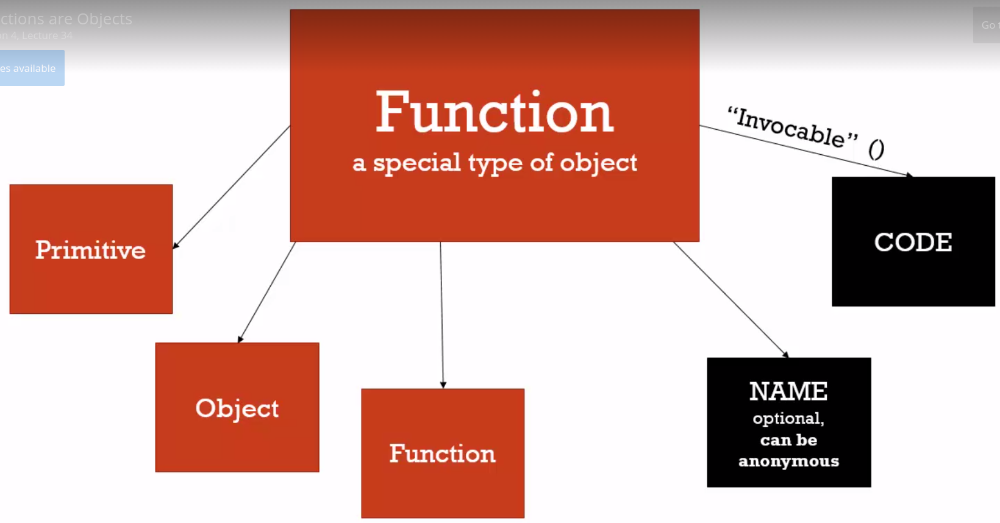
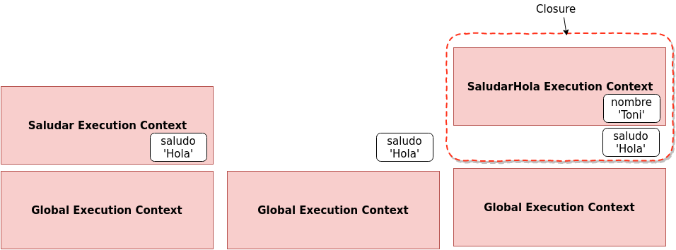
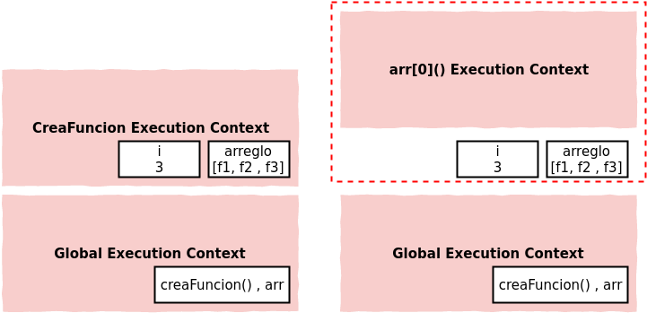
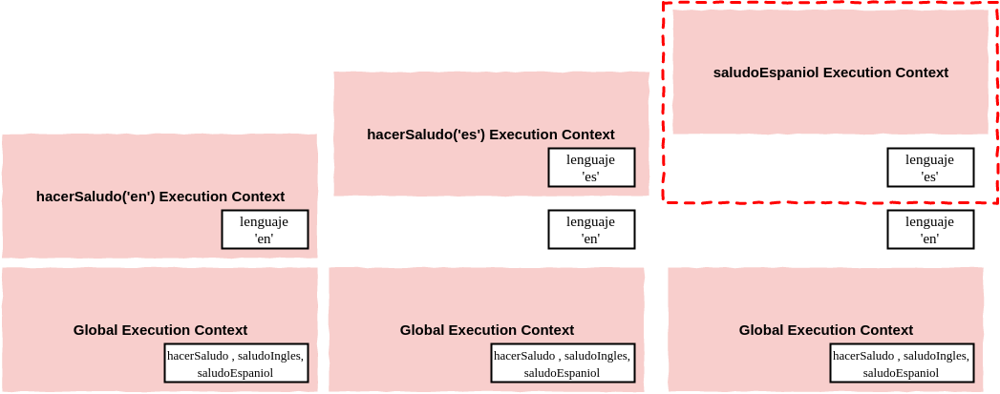

# Funciones

- Funciones
- Expresión
- Statement
- Pasando variables por referencia o por valor
- Variable `this`
- Contexto global inicial
- En el contexto de una función
- Immediately invoked functions expressions (IIFE)s
- Closures
- Call, Apply and Bind

## Funciones

Algo muy importante de JavaScript es que las funciones son de tipo `first class`, esto quiere decir que las funciones pueden ser tratadas igual que cualquier otro tipo de valor. Es decir, que podemos pasar una funcion como argumento, podemos asignar una función a una variable, podemos guardarla en un arreglo, etc..
Esta es una de las features de JavaScript que lo hace muy poderoso, hay otros lenguajes que pueden hacer lo mismo, pero el más popular es JavaScript.
De hecho, las funciones en JavaScript son un tipo especial de objetos. Este objeto, además de poder tener cualquier propiedades adentro (como cualquier objeto) tiene dos propiedades especiales: La primera es el nombre (`name`), que contiene el nombre de la función, esta propiedad es opcional (funciones anónimas). La segunda propiedad se llama `code` (código) y en ella se guarda el código que escribiste para la función.



En el código de abajo, declaramos una función y luego le agregamos una propiedad llamada `saludo` a ella. Como la función es un objeto, entonces podemos hacer esto sin problemas.

```javascript
function hola() {
  console.log("hola");
}

hola.saludo = "Buen Día";
console.log(hola);
```

También vemos que al hacer el console.log de la función, el intérprete nos devuelve el código que tiene adentro la función en una string. Esto es justamente la propiedad `code` que tienen todas las funciones.

## Expresión

Una Expresión es una unidad de código que evaluá a un valor. Por ejemplo, `a = 3`, es una expresión que devuelve el número `3`. `1 + 2` también es una expresión que retorna `3`. Las expresiones pueden ser escritas en cualquier lugar donde se espera un valor, por ejemplo: `console.log(1 + 2);`.

## Statement

Los Statements, no producen un valor directamente, si no que _hacen algo_, generalmente tienen adentro expresiones. Según el statement que usemos vamos a tener un comportamiento distinto, ejemplos de statements son `if`, `while`, `for`, etc...

En javascript, en términos de funciones podemos tener ambos `functions statements` y `functions expressions`, veamos la diferencia de ambos.

```javascript
function saludo() {
  console.log("hola");
}
```

El de arriba es un `function statement`, cuando esto es ejecutado por el intérprete no retorna nada, pero sí hace algo: reserva un espacio en memoria para la función que definimos.

```javascript
var saludo = function () {
  console.log("Hola!");
};

console.log(function () {
  //hola;
});
```

En este segundo caso, estamos usando una `function expression`, en la cual estamos creando un objeto de tipo función (anónima) y además la estamos guardando en una variable llamada `saludo`. Justamente, la variable saludo va a apuntar a una dirección de memoria que contiene el objeto de tipo función que creamos anónimamente en una expresión (esa expresión retornó el objeto que se _guardó_ en la variable.). Cuando declaramos una función anónima y la pasamos como argumento, también estamos haciendo una `function expression`.

## Pasando variables por referencia o por valor

Hay dos formas de pasar variables en cualquier lenguaje de programación, en algunos podemos elegir la forma nosotros pero en JavaScript el intérprete elige la forma él mismo.

Las dos formas son, por valor o por referencia.

Cuando pasamos algo por referencia, estamos pasando una _referencia_ o un puntero al objeto. Por lo tanto, cualquier cambio que hagamos a esa referencia, se va a ver reflejado en el objeto original.

En cambio, cuando pasamos algo por valor, estamos pasando el elemento por sí mismo, o una copia de él.

En lenguajes como _C++_ el programador puede decidir si enviar el objeto en sí (por valor) o enviar una referencia al objeto (por referencia). En JavaScript, según qué cosa estemos pasando, el intérprete decide si es por valor o referencia. Básicamente, si pasamos un valor primitivo (números, strings, etc..) estos se pasan por _valor_, pero si pasamos un objeto (cualquier objeto, incluso funciones) este se pasa _por referencia_. Podemos probar este comportamiento:

```javascript
var a = 1,
  b = 2;

a = b;
b = 1;

console.log(a);
// Como se pasó el valor de `b` y no la referencia,
// cuando cambiamos b no impacta en el valor de a.
```

```javascript
var a;
var b = { nombre: "hola" };

a = b;

b.nombre = "Chao";

console.log(a.nombre); // 'Chao'
// Cuando se hizo la asignación se pasó la referencia de b, por lo tanto
// cuando cambiamos la propiedad nombre de b, se ve reflejado en a
// porque ambas variables "apuntan" al mismo objeto en memoria
```

> Los tipos primitivos se pasan por valor, y los objeto, arreglos y funciones se pasan por referencia.

## Variable `this`

Habiamos dicho que cuando se crea el `execution context`, el interprete reserva el espacio de memoria para las variables (hoisting), guarda la referencia al `outer enviroment` y además setea la variable `this`. Esta variable va a apuntar a distintos objetos dependiendo en cómo fue invocada la función. Esto puede causar algunas confusiones. Veamos algunos escenarios:

## Contexto global inicial

Este es el caso cuando ejecutamos código en el contexto global (afuera de cualquier función). En este caso `this` hace referencia al objeto `global`, en el caso del browser hace referencia a `window`.

```javascript
// En el browser esto es verdad:
console.log(this === window); // true

this.a = 37;
console.log(window.a); // 37
```

## En el contexto de una función

Cuando estamos dentro de una función, el valor de `this` va a depender de _cómo sea invocada la función_.

### Llamadas simples

En este caso, el interprete le da a `this` una referencia al objeto `global`.

```javascript
function f1() {
  return this;
}

f1() === window; // global object
```

> Si usamos el modo `strict` de Javascript, el ejemplo de arriba va a devolver `undefined`, ya que no le deja al interprete _asumir_ que `this` es el objeto global.

### Cómo un método de un objeto

Cuando usamos el keyword `this` dentro de una función que es un método de un objeto, `this` toma hace referencia al objeto sobre el cúal se llamó el método:

```javascript
var o = {
  prop: 37,
  f: function () {
    return this.prop;
  },
};

console.log(o.f()); // logs 37
// this hace referencia a `o`
```

En este caso, _no depende_ donde hayamos definido la función, lo único que importa es que la función haya sido invocada como método de un objeto. Por ejemplo, si definimos la función afuera:

```javascript
var o = { prop: 37 };

// declaramos la función
function loguea() {
  return this.prop;
}

//agregamos la función como método del objeto `o`
o.f = loguea;

console.log(o.f()); // logs 37
// el resultado es le mismo!
```

De todos modos, hay que tener cuidado con el keyword `this`, ya que pueden aparecer casos donde es contraintuitivo (Como varias cosas de JavaScript). Veamos el siguiente ejemplo:

```javascript
var obj = {
  nombre: "Objeto",
  log: function () {
    this.nombre = "Cambiado"; // this se refiere a este objeto, a `obj`
    console.log(this); // obj

    var cambia = function (str) {
      this.nombre = str; // Uno esperaria que this sea `obj`
    };

    cambia("Hoola!!");
    console.log(this);
  },
};
```

Si ejecutamos el código de arriba, vamos a notar que después de ejecutar el código, la propiedad `nombre` de `obj` contiene el valor `Cambiado` y no `'Hoola!!'`. Esto se debe a que el keyword `this` dentro de la función cambia **NO hace referencia a `obj`**, si no que hace referencia al objeto global. De hecho, si buscamos dentro del objeto global la variable `nombre`, vamos a encontrar con el valor `'Hoola!!'` que seteamos con la función `cambia`. Esto quiere decir que no importa en donde estuvo declarada la función, si no **cómo la invocamos**.

Este comportamiento es considerado como un `bug` por mucha gente. Siempre hay que tener en mente, que JavaScript en sí es un programa codeado por personas, y que este mismo puede _tener bugs_ como cualquier otro pedazo de código!.

> Prácticamente, no podemos saber a ciencia cierta que valor va a tomar el keyword hasta el momento de ejecución de una función. Porque depende fuertemente de cómo haya sido ejecutada.

Para resolver este tipo de problemas existe un patrón muy común, y se basa en guardar la referencia al objeto que está en `this` antes de entrar a una función donde no sé a ciencia cierta que valor puede tomar `this`:

```javascript
var obj = {
  nombre: "Objeto",
  log: function () {
    this.nombre = "Cambiado"; // this se refiere a este objeto, a `obj`
    console.log(this); // obj

    var that = this; // Guardo la referencia a this

    var cambia = function (str) {
      that.nombre = str; // Uso la referencia dentro de esta funcion
    };

    cambia("Hoola!!");
    console.log(this);
  },
};
```

De esta forma, `that` (puede tener cualquier nombre) va a apuntar al objeto `obj` (`this` apuntaba a ese objeto cuando hicimos la asignación). Ahora si, podemos usar `that` en vez de `this` y estar seguros qué es lo que va a tener adentro.

## Immediately invoked functions expressions (IIFE)s

Vamos a ver un concepto ampliamente usado por los desarrolladores de JavaScript, y ver cómo nos puede servir. Ya vimos la diferencia entre una `function statement` y una `function expression`. Tambien sabemos que las funciones son objetos, y que podemos invocarlas usando el operador `()`. Por lo tanto podemos hacer los siguiente:

```javascript
var hola = (function () {
  return "hola";
})(); // ACA ESTOY INVOCANDO LA FUNCIÓN!.
```

Lo que hicimos fue _invocar la función inmediatamente despues de escribir la expresión_, de ahi viene el nombre de IIFE.

```javascript
var hola = (function (nombre) {
  return "Hola " + nombre;
})("Toni");
```

Podemos usar todo lo que sabemos de funciones con las IIFE, en el ejemplo de arriba la función recibe un parámetro, que se lo pasamos cuando la invocamos inmediatamente. Luego de ejecutar eso, la variable `hola` va a contener la string `Hola Toni`.

También podemos declarar funciones anónimas en una `function expression` y **ejecutarla** sin tener que guardarla en ningún lugar, la ejecutamos como si fuera cualquier expresión, para eso voy a tener que envolver la declaración de la función con `()` (de hecho lo hacemos para _engañar al syntax parser_):

```javascript
(function (nombre) {
  console.log(nombre);
})("Toni"); // IIFE
```

Este es el clásico ejemplo de una _IIFE_, este patrón lo vas a ver en casi todos las librerías y frameworks que hay hoy. Ya que nos permite ejecutar código _sobre la marcha_. Además, cuando llega a esa linea, y ejecuta esa función, el interprete invoca la función y por lo tanto crea un nuevo _contexto de ejecución_ para ese código. Por lo tanto, las variables que declare adentro, van a estar viviendo en ese nuevo _contexto_ y no en el **contexto global**. Esto último es lo más importante de este patrón, ya que nos crea un nuevo _namespace_ sólo para nosotros y estamos seguros que no vamos a colisionar con variables que fueron declaradas en el contexto global por otras personas (Justamente por esto, los frameworks y librerías utilizan fuertemente este patrón).

A veces es necesario acceder al objeto global dentro de nuestra función. Lo que podemos hacer, es pasar una referencia al objeto global cuando invocamos nuestra función:

```javascript
(function (global, nombre) {
  console.log(nombre);
})(window, "Toni"); // IIFE
```

De esta forma, tenemos acceso al objeto global y estamos protegidos de cualquier accidente. Nuestro código está a salvo!

## Closures

Veamos a que se refieren con un ejemplo:

```javascript
function saludar(saludo) {
  return function (nombre) {
    console.log(saludo + " " + nombre);
  };
}

var saludarHola = saludar("Hola"); // Esto devuelve una función

saludarHola("Toni"); // 'Hola Toni'
```

Veamos paso a paso lo que va a ocurrir cuando ejecutemos este código. Primero se creará el `contexto de ejecución global`, en esta etapa el interprete guardará espacio para la declaración de la función `saludar`. Luego, cuando se encuentra con la invocación a la función `saludar`, va a crear un nuevo contexto, y como vemos dentro de ese contexto la variable saludo va a tomar el valor que le pasamos por parámetro:`'Hola'`. El stack quedaría cómo está representado en la primera parte de la figura de abajo.



Luego de terminar de ejecutar y retornar una funcion (la que estamos guardando en `saludarHola`), ese contexto es _destruido_. Pero que pasa con la variable `saludo`?. Bueno, el interprete saca el contexto del stack, pero deja en algún lugar de memoria las variables que se usaron adentro (hay un proceso dentro de JavaScript que se llama `garbage collection` que eventualmente las va limpiando si no las usamos). Por lo tanto, esa variable todavía va a estar en memoria (Segunda parte de la imagen).
Por último ejecutamos la función `saludarHola` y pasamos como parámetro el string `'Hola'`. Por lo tanto se crea un nuevo contexto de ejecucción, con la variable mencionada. Ahora, cómo adentro de la función `saludarHola` hacemos referencia a la variable `saludo`, el interprete intenta buscarla en su scope; Cómo `saludo` **no está definida en ese contexto**, el interprete sale a buscarla siguiente la `scope chain` y a pesar que el contexto ya no existe, **la referencia al ambiente exterior y a sus variables todavía existe**, a este fenómeno es que le llamamos _CLOSURE_. En el ejemplo, el _closure_ está definido por el rectángulo punteado de rojo. Las _closures_ no son algo que se escriban, o qué se le indique al interprete, simplemente son una _feature_ del lenguaje, simplemente ocurren. Nosotros no tenemos que pensar ni ocuparnos de mantener variables en memoria según el contexto de ejecucción en el que estemos, el interprete se encargará de esto siempre. Los _Closures_ nos van a permitir armar algunos patrones interesantes.

### Ejemplo Closures

```javascript
var creaFuncion = function () {
  var arreglo = [];

  for (var i = 0; i < 3; i++) {
    arreglo.push(function () {
      console.log(i);
    });
  }
  return arreglo;
};

var arr = creaFuncion();

arr[0](); // 3 sale un 3, qué esperaban ustedes??
arr[1](); // 3
arr[2](); // 3
```

¿Porqué el console log da todos `3`?

Para entenderlo veamos cómo se van creando los contextos de ejecución y donde van quedando los objetos que creamos.
En un primer momento se creará el contexto global, donde van estar definida la función `creaFuncion` y también el arreglo `arr`.

En un segundo momento, se va a crear el contexto de la función `creaFuncion` que fue ejecutada. Dentro de ella, se reserva espacio para un arreglo llamado `arreglo`, y para la variable `i`.



Cuando el interprete llega a la línea del `return`, se _destruye_ el contexto de ejecucción de `creaFuncion` y volvemos al contexto global. La siguiente ejecución que se produce es la de `arr[0]()`. Cabe notar que la variable `arr` _apunta_ o _hace referencia_ al arreglo `arreglo` que _vive_ en el contexto de `creaFuncion`, esto sucede porque los arreglos son _objetos_ y estos se pasan por referencia y no por valor. Como vemos, se crea el contexto de ejecución para esa función (`arr[0]`). Dentro de esta hay una referencia a la variable `i` , que también _vivia_ en el contexto de `creaFuncion`, ya destruido. Como el interprete no encuentra otra variable `i` dentro del nuevo contexto, sale a buscarla en sus referencias y ,como sabemos, la va a encontrar en el _closure_ que envuelve estas variables. Luego, ejecuta las siguientes funciones `arr[1]()` y `arr[2]()`, y en ambos casos sucede lo mismo. Justamente por eso, en cada console log, se imprimi el valor que tiene la variable `i`, que es `3` (el valor que quedó cuando se terminó el lazo dentro de `creaFuncion`).

Si quisieramos que cada función guardase el valor de `i`, deberíamos crear un _execution content_ donde se cree una variable nueva en cada iteración. Para eso vamos a usar una _IIFE_ a la cuál le vamos a pasar como parámetro `i`. Como estamos ejecutando la función, se va a a crear un contexto nuevo por cada ejecución, y por ende van a exisiter tres variables `j` (cada una en un contexto distinto) que contendrán los valores recibidos por parámetro (_1, 2 y 3_).

```javascript
var creaFuncion = function () {
  var arreglo = [];
  for (var i = 0; i < 3; i++) {
    // Otra forma, poniendo let en lugar de var
    arreglo.push(
      (function (j) {
        return function () {
          console.log(j);
        };
      })(i)
    );
  }
  return arreglo;
};

var arr = creaFuncion();

arr[0](); // 1
arr[1](); // 2
arr[2](); // 3
```

### Function Factory

Vamos a ver un patrón para crear funciones, muy usado en el desarrollo de frameworks, y que existe gracias a los _closures_.

Veamos el siguiente código, primero definimos una función que va retornar otra función (esta sería nuestra _fábrica de funciones_), esta recibe como parámetro el lenguaje del saludo, y retorna una función que salude (console loguee) en el idioma recibido.

```javascript
function hacerSaludo(lenguaje) {
  return function () {
    if (lenguaje === "en") {
      console.log("Hi!");
    }

    if (lenguaje === "es") {
      console.log("Hola!");
    }
  };
}

var saludoIngles = hacerSaludo("en");
var saludoEspaniol = hacerSaludo("es");
```

Si pensamos que ocurre cuando ejecutamos esas líneas, vamos a ver que se crearon dos closures. Uno para cada ejecución de la función `hacerSaludo`, en un closure la variable `lenguaje` contiene `es` y en el otro contiene `en`. Entonces, cuando invoquemos las funciones `saludoIngles` o `saludoEspaniol`, el intérprete va a salir a buscar la referencia a esa variable fuera del contexto de ejecución y la va a encontrar en el closure correspondiente.

O sea, que estamos usando el concepto de **closure** para setear un parámetro para que viva sólo dentro de una función, además nadie puede ingresar al valor de `lenguaje`, esto agrega un poco de seguridad a nuestro código.



> Cada vez que invocamos una función se genera un execution context para esa ejecución. Si invocamos muchas veces la misma función ocurre lo mismo.

### Closures and Callbacks

Ahora que sabemos lo que son los _closures_, si pensamos en todo lo que hicimos algunas vez con JavaScript, es muy probable que nos demos cuenta que ya lo veniamos usando (tal vez sin saberlo).

Por ejemplo:

```javascript
function saludarMasTarde() {
  var saludo = "Hola";

  setTimeout(function () {
    console.log(saludo);
  }, 3000);
}

saludarMasTarde();
```

En el ejemplo de arriba, cuando inocamos a `saludarMasTarde` estamos creando un execution context, en el que invocamos a la función `setTimeout` y donde definimos la variable `saludo`. Ese execution context es destruido, pero `setTimeout` contiene una referencia a `saludo`. Closure, Maybe?
Lo que realmente ocurre es que cuando pasan los tres segundos (esto lo hace algún componente externo al interprete), se lanza un evento diciendo que hay que ejecutar el callback, que es justamente una `function expression`. Entonces se crea un execution context para esa función, y dentro de ella se usa `saludo`, pero no está en ese contexto, entonces el interprete sale a buscarla afuera, y la encuentra en el `closure`!

O sea que se hicieron algo parecido a esto (tal vez usando eventos), entonces ya usaron _functions expressions_ y muy probablemente _closures_ tambien!

## Call, Apply and Bind

Cuando vimos el keyword `this`, dijimos que el interprete era el que manejaba el valor de este. Bueno, esto no es del todo cierto, hay una serie de variables que nos van a permitir poder setear nosotros el keyword `this`.

Como en JavaScript las funciones son un tipo objeto especial (vimos que tenian algunas propiedades especiales como `code` y `name`), estas también contienen métodos propios. Todas las funciones tienen acceso a los métodos:

- call()
- bind()
- apply()

Justamente invocando estos métodos vamos a poder tener control sobre el keyword `this`. Veamos algunos ejemplos:

```javascript
var persona = {
  nombre: "Franco",
  apellido: "Chequer",

  getNombre: function () {
    var nombreCompleto = this.nombre + " " + this.apellido;
    return nombreCompleto;
  },
};

var logNombre = function () {
  console.log(this.getNombre());
};
```

En este ejemplo, vamos a usar el keyword `this` para invocar el método del objeto persona. Como verán, el código de arriba produce un error, ya que cuando ejecutamos `logNombre()`, el `this` que está adentro hace referencia al objeto global, y ese objeto no tiene un método `getNombre`.

```javascript
var logNombrePersona = logNombre.bind(persona);
logNombrePersona();
```

La función `bind()` devuelve una **copia** de la función, la cúal tiene internamente asociado el keyword `this` al objeto que le pasemos por parámtro. Si la llamamos sobre `logNombre` y le pasamos `persona` como argumento, vamos a ver que al ejecutar la _nueva_ función `logNombrePersona()` se va a loguear correctamente el nombre de `persona`.

Si usamos `bind()` entonces la nueva función queda **siempre** ligada al objeto que pasamos cómo argumento. O sea que si quisieramos usarla para otro objeto, tendríamos que crear una nueva _copia_ de la función y _bindiarle_ un nuevo objeto.
Si ese es el caso, podríamos usar `call()`, veamos cómo funciona:

```javascript
logNombre.call(persona);
```

En este caso, estamos invocando la función original `logNombre`, pero con `call` le estamos indicando a qué objeto tiene que hacer referencia `this` dentro de esa función.

El primer argumento de `call` es el objeto a usar cómo `this`. Despues de este puedo pasar otros argumentos, que serán pasados a la función que estamos invocando. Por ejemplo, si nuestra función recibiera argumentos, usariamos `call` de la siguiente manera:

```javascript
var logNombre = function (arg1, arg2) {
  console.log(arg1 + " " + this.getNombre() + " " + arg2);
};

logNombre.call(persona, "Hola", ", Cómo estas?"); //Hola Franco Chequer, Cómo estas?
```

De hecho, la función `apply` es casi igual a `call`, excepto que recibe los argumentos de distinta manera. `apply` necesita dos arguemntos, el primero es el objeto a bindear con `this` (igual que `call`) y el segundo parámetro es un arreglo, en este arreglo pasamos los argumentos que va a usar la función que invocamos. Por ejemplo, para obtener el mismo comportamiento que arriba, pero con `apply`:

```javascript
var logNombre = function (arg1, arg2) {
  console.log(arg1 + " " + this.getNombre() + " " + arg2);
};

logNombre.apply(persona, ["Hola", ", Cómo estas?"]); //Hola Franco Chequer , Cómo estas?
```

Un arreglo puede ser más fácil de pasar cuando no sabemos a priori cuantos argumentos le voy a pasar.

> Vamos a usar `call` o `apply` según nos convenga para resolver el problema que necesitemos.

Vamos a usar estos métodos muchas veces cuando programemos, tal vez ahora no se imaginen un caso puntual, pero los habrá! se los aseguro!
Veamos un simple ejemplo donde podríamos usarlos, esto se conoce cómo **function borrowing** (tomando prestadas funciones). Vamos a crear una segunda _persona_, pero que no tenga el método `getNombre` como la primera:

```javascript
var persona2 = {
  nombre: "Manu",
  apellido: "Barna",
};
```

Ahora, vamos a pedirle prestado el método `getNombre` a la primera _persona_ y la vamos a usar con la nueva.

```javascript
persona.getNombre.call(persona2); //'Manu Barna'
```

Con esto pudimos invocar un método de un objeto, pero usándolo con otro!

Veamos otro mini patron: _function currying_, este involucra `bind`.
Como `bind` crea una nueva función, si le pasamos parámetros, estos quedan **fijos** en la nueva función. En el ejemplo no vamos a bindiar `this` con nada, pero si unos parámetros.
Digamos que tenemos una función que multiplica dos números recibidos por parámetro. Y nos gustaría construir una función que multiplique un número recibido por argumento por dos. Para esto podríamos usar `bind` y le pasamos cómo primer parámetro `this` (en este caso `this` hace referencia al contexto global), y como segundo parámetro un `2`. Guardamos el resultado en una nueva variable:

```javascript
function multiplica(a, b) {
  return a * b;
}

var multiplicaPorDos = multiplica.bind(this, 2);
```

De esta forma, tenemos una nueva función donde el parámetro `a` es siempre `2`, gracias a `bind`. Nótese, que dentro de `multiplicaPorDos`, `this` sigue haciendo referencia al objeto global, porque cuando lo bindeamos le pasamos ese parámetro.

> Function Currying se refiere a crear una copia de una función pero con algunos argumentos preseteados. En JavaScript lo hacemos con `bind`.
