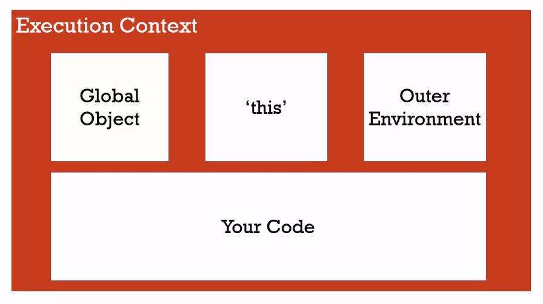
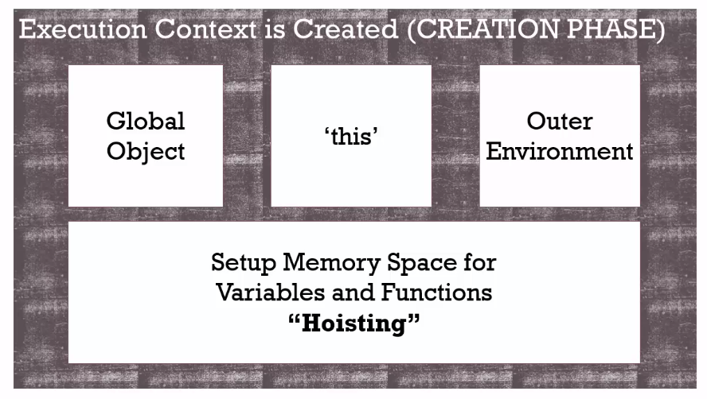
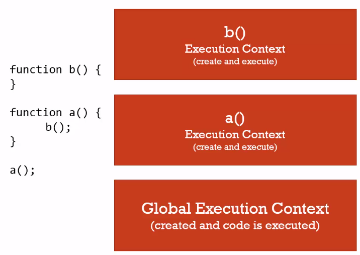

## Fundamentos

https://es.javascript.info/

- var, let y const
- Single Threaded y Sincrónico
- Syntax Parser
- Lexical Environment
- Contexto de ejecución
- Ámbito global
- Creando el contexto de ejecución / Hoisting
- Execution stack
- Scope
- Asynchronous non blocking
- Manejo de excepciones

## var, let y const

Las variables `var` tienen un ámbito de función o ámbito global, mientras que `let` y `const` tienen un ámbito de bloque.

Las variables `var` pueden ser modificadas y re-declaradas dentro de su ámbito; las variables `let` pueden ser modificadas, pero no re-declaradas; las variables `const` no pueden ser modificadas ni re-declaradas.

Todas ellas se elevan a la parte superior de su ámbito. Pero mientras que las variables `var` se inicializan con `undefined`, `let` y `const` no se inicializan.

Mientras que `var` y `let` pueden ser declaradas sin ser inicializadas, `const` debe ser inicializada durante la declaración.

El valor de `const` no se puede cambiar mediante reasignación (es decir, mediante el uso del operador de asignación) y no se puede volver a declarar (es decir, mediante una declaración de variable). Sin embargo, si un `const` es un objeto o una matriz, sus propiedades o elementos se pueden actualizar o eliminar.

## Single Threaded y Sincrónico

JavaScript es **Single Threaded** y sincrónico, es decir que sólo puede hacer un sólo comando o instruccion en cada momento y que lo hace en orden, empieza la instrucción siguiente cuando termina la anterior. Esto puede sonar confuso, porque vemos que, en el browser por ejemplo suceden muchas cosas al _mismo tiempo_ o bien, cuando tiramos una función asincrónica y esta se realiza mientras nosotros hacemos otras cosas, etc... esto sucede porque en general usamos javascript en conjunto con otros **procesos**, que pueden ser o no single threaded y en conjunto nos da la sensación que está ocurriendo todo al mismo tiempo, aunque es muy probable que no sea así.

## Syntax Parser

El "Syntax Parser" (Analizador Sintáctico) es una parte crucial en la interpretación y ejecución de un lenguaje de programación. En el contexto de JavaScript, el Syntax Parser es una etapa fundamental en el ciclo de vida del código fuente antes de que se ejecute.

El trabajo del Syntax Parser es descomponer el código fuente escrito por los desarrolladores en partes significativas, para que pueda ser entendido y ejecutado por la máquina. En otras palabras, toma el código escrito en lenguaje humano y lo convierte en una estructura que la computadora puede entender y ejecutar.

## Lexical Environment

El "Lexical Environment" (Entorno Léxico) representa el contexto en el cual se ejecuta una porción de código y almacena información sobre las variables y sus valores en ese contexto.

Cada vez que se ejecuta una función en JavaScript, se crea un nuevo "Lexical Environment" que contiene información sobre las variables locales y sus valores en ese momento. Este entorno léxico se compone de dos partes:

1. **Entorno de Registro (Environment Record):** Es una estructura que mantiene todas las declaraciones de variables locales, funciones y argumentos de la función actual. En este entorno, se almacenan y se accede a las variables y funciones definidas dentro de la función.

2. **Entorno Externo (Outer Environment):** Es una referencia al "Lexical Environment" en el cual la función se encuentra anidada. Permite que la función acceda a las variables y funciones de los entornos superiores (por ejemplo, cuando se trata de alcances de cierre o closures).

Los "Lexical Environments" son anidados de manera jerárquica, lo que significa que las funciones pueden acceder a las variables de los entornos en los que están definidas y en los que están contenidas.

Este concepto es fundamental para entender cómo JavaScript administra el alcance de las variables y cómo las funciones pueden recordar y acceder a variables incluso después de haber terminado su ejecución. En resumen, el "Lexical Environment" es una estructura que proporciona contexto y alcance para la ejecución del código en JavaScript.

## Contexto de ejecución

El contexto de ejecución contiene información sobre qué código se está ejecutando en cada momento. Además de mantener el código que tiene que ejecutar, también mantiene más información sobre desde dónde se invocó ese código, en qué lexical enviroment está, etc...

Hay dos tipos principales de contexto de ejecución en JavaScript:

1. **Contexto de Ejecución Global:** Este es el contexto que se crea cuando se inicia la ejecución del programa. Contiene todas las variables y funciones que son accesibles desde cualquier parte del código.

2. **Contexto de Ejecución de Función:** Cada vez que se llama a una función, se crea un nuevo contexto de ejecución de función. Este contexto incluye las variables locales de la función, los parámetros pasados y cualquier otra variable definida dentro de la función.

El contexto de ejecución no solo incluye información sobre las variables y funciones disponibles, sino que también controla el flujo de ejecución. Cuando una función se llama, se crea un nuevo contexto de ejecución de función y se agrega a la "pila de llamadas" (call stack). Una vez que la función ha terminado de ejecutarse, su contexto se elimina de la pila de llamadas y el control regresa al contexto anterior.

El contexto de ejecución también está relacionado con la administración del alcance (scope) de las variables y las relaciones entre funciones en términos de alcances de cierre (closures)

## Ámbito global

Cada vez que ejecutamos algo en JavaScript **se corre dentro de un contexto de ejecución**. Como todo el código corre en un contexto, si no especificamos ese contexto (veremos cómo se hace despues) entonces el código se va a ejecutar en el **contexto global**, que es el contexto de base que nos crea automáticamente el interprete.

> Básicamente, vamos a decir que es **global** cualquier bloque de código que no esté declarado dentro de una función.

Además de ejecutar el código que le pasemos, también crea un **objeto global** y además crea una variable llamada **this**. Por ejemplo, si usamos el engine de javaScript de Chrome (este es el intérprete), y vamos a la consola vamos a ver que el _objeto global_ que mencionamos el es objeto `window` y que la variable `this` hace referencia a ese objeto. Esos objetos los generó el interprete cuando creó el ambiente de ejecución. Si abro otra pestaña voy a tener otro objeto `window` similar, ya que es otro contexto de ejecución.


> Si corremos JavaScript en otro ambiente que no sea el browser, por ejemplo con NodeJs o con otros engines, es muy probable que el objeto global no sea `window` y sea otro. Pero siempre hay UN objeto global.

En JavaScript, cuando declaramos variables y funciones en el contexto global, estos se guardan en el objeto global. Si declaramos variables y funciones en la consola de desarrollador, vamos a ver que estás aparecerán dentro de `window` que es el objeto global.

Por último, el contexto de ejecución tambien mantiene una referencia a otros contextos de ejecución (desde donde fue creado). Como ahora hablamos del contexto global, esta referencia contiene el valor `null`, ya que no hay otro contexto que haya invocado a este.



## Creando el contexto de ejecución / Hoisting

Veamos como el intérprete crea el contexto de ejecución global. Cuando el interprete lee un bloque de código realiza un proceso llamado `hoisting`. Básicamente lee todo el código buscando declaraciones de variables y funciones, y reserva un espacio en memoria para ellas.

Probá ejecutar lo siguiente en JavaScript:

```javascript
bar();
console.log(foo);

var foo = "Hola, me declaro";
function bar() {
  console.log("Soy una función");
}

// Soy una función
// undefined
```

En otros lenguajes, si intentaramos invocar una función o una variable que está definida _'más abajo'_ seguramente tendríamos un error. Pero JavaScript, al realizar el proceso de `hoisting`, ya tiene reservado el espacio para esas variable y funciones, por lo tanto no se genera un error. Notesé que a la función la pudo ejecutar, esto quiere decir que durante el hoisting guardó su contenido también, no sólo reservó el espacio. Pero con el caso de la variable, sólo reservo el espacio, ya que cuando hacemos el `console.log` vemos que contiene `undefined`.

> Podemos pensar el Hoisting como que el interprete '_mueve_' las declaraciones a la parte de más arriba de nuestro código. Sólo lo hace con las declaraciones y no con las inicializaciones.

Para entender por qué el interprete hace esto, tenemos que saber cómo se crea el contexto de ejecución. Esto se hace en dos fases. La primera es la fase de creación (creation phase). En esta fase el interprete genera el _objeto global_, asigna la variable _this_ y las referencias a otro contexto de ejecución (Outer Context), y además reserva el espacio para todas las variables y funciones que vaya a utilizar ese contexto, justamente en este último paso es donde se genera el proceso de `hoisting`.



> El hosting es un ejemplo de las _cosas extras_ que hace el interprete sin que nosotros se lo pidamos. Si no las conocemos, nos puede pasar que veamos comportamientos extraños y no sepamos de donde vienen (como que podamos usar funciones que no hemos declarado antes de invocarlas!!)

La segunda fase es la _fase de ejecucción_, en esta fase, ya tenemos todo lo que se creo en la primera fase, y ahora sí el intérprete **ejecuta** nuestro código, línea por línea!.

Este proceso de crear contextos de ejecución sucede siempre al principio cuando se crea el contexto global, ahora vamos a ver que también sucede cada vez que invocamos una función en nuestro código, como se pueden imaginar, en un script cualquiera, es muy probable que se creen varios contextos de ejecución (muchas invocaciones a funciones), estos contextos se van a ir _apilando_ en la **pila de ejecución o execution stack**.

## Execution stack

```javascript
function b() {
  console.log("B!");
}

function a() {
  // invoca a la función b
  b();
}

//invocamos a
a();
```

Veamos que ocurre cuando corremos este script: Como sabemos, lo primero que pasa es la creción del contexto global y el proceso de _hoisting_, entonces la función `a` y `b` van a estar en memoria. Una vez que termina eso, empieza la fase de ejecución, en esa fase es que el interprete va a recorrer línea por línea el script. En nuestro ejemplo hay una única línea para ejecutar (las otras las leyó durante el _hoisting_) que es la línea donde invocamos a `a()`.

Lo que sucede ahora, es que se crea un _nuevo contexto de ejecución_ que se va a poner arriba del contexto de ejecución global (creando la pila). Básicamente, el contexto que esté arriba de la pila, es el que se está ejecutando en ese momento (o cuando le den tiempo de procesador a JavaScript). Cuando se creó ese contexto nuevo, pasó lo mismo que cuando creamos el global, el intérprete generó la variable `this` y pusó las referencias al `outer context` (en este caso el outer context es el contexto global), después de hacer todo eso, el intérprete va a ejecutar línea por línea el código del nuevo contexto, es decir, _el código de la función `a`. Ahora, dentro de `a` hay una sóla línea de código, y en esa línea se invoca a `b`. Si! como se imaginan, el intérprete va a crear un \_nuevo_ contexto de ejecución para la función `b` (haciendo de nuevo los pasos previamente mencionados), y poniendolo en la cima de la pila.



Cada invocación a una función crea un contexto de ejecución nuevo, que pasa por las dos fases de creación antes mencionadas. Cuando se termina de ejecutar, se _destruye_ y se saca de la pila de ejecución para seguir con los que quedan.

## Scope

Cada contexto maneja sus propias variables, y son independientes de los demás. Justamente por eso, podemos usar los mismos nombres de variables dentro de funciones que creamos sin que _pisen_ las demás.
También sabemos que podemos acceder a una variable declarada en el contexto global dentro de una función. Esto se debe a que JavaScript primero busca una variable dentro del contexto que se está ejecutando, si no la encuentra ahí, usa la referencia al `outer context` para buscarla dentro de ese contexto. Gracias a esto vamos a poder acceder a variables que estén afuera de nuestro contexto (siempre y cuando no hayamos declarado una nueva con el mismo nombre!!).

Veamos en el código siguiente el comportamiento de las variables:

```javascript
var global = "Hola!";

function a() {
  // como no hay una variable llamada global en este contexto,
  // busca en el outer que es el global
  console.log(global);
  global = "Hello!"; // cambia la variable del contexto global
}

function b() {
  // declaramos una variable global en nuestro contexto
  // esta es independiente
  var global = "Chao";
  console.log(global);
}

a(); // 'Hola!'
b(); // 'Chao'
console.log(global); // 'Hello'
```

Para esto vamos a introducir el término `scope`, este es **el set de variable, objeto y funciones al que tenemos acceso en determinado contexto**. En el ejemplo anterior, la variable `global` está definida en dos `scopes` distintos, uno es el `scope global` y el otro es el `scope` de la función `b`, esto quiere decir que, a pesar de tener el mismo nombre, estas dos variables son distintas.

Justamente, cuando JavaScript no encuentra una variable en su scope, lo que hace es buscar en otros scopes (de contextos que esten en la referencia de `outer contexts`). A esta búsqueda en distintos scope se la conoce como **the scope chain**, ya que el intérprete busca en cadena scope por scope por el nombre de la variable, hasta llegar al scope global. Noten que el `outer enviroment` no es necesariamente el contexto que esté debajo en la pila de ejecucción, ni tampoco el contexto en donde se invocó la función, si no **es el contexto en donde se definió la función!** (Se acuerdan que dijimos que en javascript el _lexical enviroment_ era importante?).

> Si el intérprete llega el scope Global sin encontrar la variable, entonces va a tirar un error.

Prueben el siguiente código y miren comó cambió todo cuando declaramos la funcion `a` **dentro** de la función `b`:

```javascript
var global = "Hola!";

function b() {
  var global = "Chao";
  console.log(global); // Chao
  function a() {
    // como no hay una variable llamada global en este contexto,
    // busca en el outer que es scope de b;
    console.log(global); //Chao
    global = "Hello!"; // cambia la variable del contexto de b()
  }
  a();
}

//a(); Ya no puedo llamar a a desde el scope global, acá no existe.
b();
console.log(global); // 'Hola!'
```

## Asynchronous non blocking

Ahora que sabemos un poco más sobre cómo hace JavaScript para ejecutar el código, veamos que pasa cuando usamos una función asincrónica a la que le pasamos un callback.

> **Callback**: Le llamamos así a una función que le pasamos como argumento a otra función, para que sea invocada en esta ultima, en general cuando se cumpla una condición o termine de realizar algo (leer un archivo, escribir en una base de datos, traer datos de internet, etc...) .

Cuando decimos código _Asincrónico_ quiere que su ejecución o su completitud está diferida en el tiempo. Por ejemplo, cuando declaramos un evento, el código o la función callback se va a ejecutar cuando suceda ese evento y no cuando el intérprete lee esas líneas, o cuando hacemos un request tipo _AJAX_ y esperamos que llegue la respuesta, etc... En todos estos casos, el engine JavaScript sigue haciendo o ejecutando otras líneas de código, y esto nos puede dar la _sensación_ que estamos haciendo más de una cosa a la vez. Pero al principio dijimos que javascript es sincrónico y que ejecuta _una sóla cosa a la vez_, veamos cómo logra darnos esa sensación.

Para entender esto, tenemos que ver un poco la imagen grande. Cuando hablamos del engine Javascript tenemos que comprender que nunca actuá sólo, siempre va a estar acompañado por otros componentes de software. El Engine de JavaScript tiene formas de comunicarse con estos otros componentes. Por ejemplo, el componente encargado de _renderizar_ las páginas, o el componente encargado de hacer _http requests_ (en general estos están programados en C o C++). Lo que sucede entonces, es que JavaScript le **pide** cosas a los demás componentes y les pide que le **avise** cuando terminen de hacer esas cosas. Por lo tanto, los demás componentes del browser se encargán de hacer ese trabajo y cuando sucede un evento o terminan una tarea le _avisan_ al engine, este interrumpe su proceso normal y mete el callback en el execution stack para realizarla.

Para lograr este comportamiento, el engine JavaScript tiene lo que se conoce como **Event Queue**, que es una cola que inicialmente está vacía y es en donde el browser (o quien se encarge de realizar las tareas) va a ir poniendo los avisos notificando que se terminó de ejecutar tal tarea. Ahora el engine JavaScript intercala cosas que tienen que ejecutar de su _execution stack_ con cosas que tiene que hacer del **event queue**, de esta forma nos da la sensación que hay cosas que se hacen en paralelo. Cuando en realidad estamos delegando las tareas a otros componentes.

> Para entender exactamente como trabaja el _Event queue_ en conjunto con los demás componentes miren [este video](https://www.youtube.com/watch?v=8aGhZQkoFbQ), en donde está perfectamente explicado.

## Manejo de excepciones

Básicamente, es posible que el código _levante (raise)_ o _tire (throw)_ una excepción, que es un valor (un objeto). Podríamos decir que es parecido a un `return`, pero con superpoderes, porque este `return` puede volver no sólo _salir_ de la función en la que está, si no saltear varios execution contexts hasta llegar el entorno más alto donde se haya iniciado la serie de invocaciones que llegaron a generar una excepción. En inglés este proceso se conoce como _unwinding the stack_.
Por suerte, cuando programamos podemos intentar _agarrar (catch)_ una excepción que va _subiendo_ (o _bajando_) por el stack de ejecución, de tal forma que ejecutemos código en donde agarramos la excepción y seguir desde ahí.
Para hacer esto en JavaScript vamos a usar el statement: `try` y `catch`:

```javascript
      try {
         //Código a ejecutar
         [break;]
      }

      catch ( e ) {
         // Código a ejecutar si ocurre una excepción (acá la agarramos)
         [break;]
      }
      // el finally es opcional
      [ finally {
         // Siempre se ejecuta este código, haya o no una excepción
      }]
```

Por ejemplo:

```javascript
function lastElement(array) {
  if (array.length > 0) return array[array.length - 1];
  else throw "No existe el último elemento de un arreglo vacío.";
}

function lastElementPlusTen(array) {
  return lastElement(array) + 10;
}

try {
  print(lastElementPlusTen([]));
} catch (error) {
  print("Hubo un problema ", error);
}
```

Cómo vemos en el ejemplo, `throw` es el _keyword_ usado para crear una excepción. Ahora, cualquier código que se ejecute, o haya sido ejecutado desde lo que esté dentro del `try` statement, al generar una excepción, va a frenar su ejecución y devolver la excepción al `catch` statement. La variable `error`, en este caso, es el **nombre** que le damos a la _excepción_ que acabamos de capturar.

> Si no hay excepciones, entonces nunca se ejecuta lo que está en `catch`.

Noten que la función `lastElementPlusTen` no tiene idea que `lastElement` puede no funcionar, simplemente la invoca. Eso es lo bueno de manejar excepciones, sólo nos tenemos que concentrar en donde se produce, y donde la atrapamos, todas las invocaciones en el medio, no tienen que enterarse.

Tal vez no lo sabíamos, pero muchos errores en realidad lo que hacen es tirar una excepción. Por ejemplo:

```javascript
try {
  console.log(hola);
} catch (error) {
  console.log("Atrapado: " + error.message);
}
```

En casos como este, Objetos especiales son tirados como error. Estos objetos contienen una propiedad `message`, que contiene una descripción del problema. Podemos crear nosotros mismos este tipo de Objetos usando el constructor:

```javascript
throw new Error("Hola no existe!!!");
```

Cuando una excepción es _tirada_, pero no hay nadie que la _atrape_, empieza a subir por el stack de ejecución, hasta que finalmente llega hasta el ambiente global, en donde es _atrapada_ por este. Por lo tanto, cada _enviroment_ va a manejar como quiera la excepción, en general dejan de ejecutar lo que estaban haciendo y te muestran la excepción con un formato particular.

### Errores con el Event Emitter

En ciertos casos, por la naturaleza asincrónica de JavaScript, podemos perder el rastro de cómo suben las excepciones, o tal vez queremos saber si hay un error o no en otro contexto por el cúal no _subirá_ la excepción. Para resolver esto, podemos usar el **event emitter** como un emisor de errores. Básicamente, pondríamos un _listener_ a escuchar por un evento de tipo **Error**, y luego, en nuestro código simplemente emitiriamos un evento de este tipo cuando encontremos un error.

### Error-Fist callback

Cuando codeamos funciones que ejecutan callbacks, si existió un error podemos crear un nuevo `Error` y pasarlo como **primer parámetro** cuando invocamos el callback:

```javascript
//hubo un error
return cb(new Error("pasó tal cosa"), null);

// no hubo problemas
return cb(null, datos);
```

Noten, que cuando hacemos esto no ejecutamos un `throw`, ya que esperamos que alguien lo haga cuando vea el resultado del callback. De esta forma, estamos generando errores **Asincrónicos**.

> Si usamos el patrón de Event Emitter o error first callback los errores se generan asincrónicamente, si lo hacemos con `throw` lo estamos haciendo de manera sincrónica.

### Ejemplos de funciones conocidas y cómo manejan los errores

| **Función**  | **Tipo de función** |  **Ejemplo de error** | **Tipo de error** | **Qué usa** |           **Como lo manejamos** |
| ------------ | ------------------: | --------------------: | ----------------: | ----------: | ------------------------------: |
| `fs.stat`    |         asincrónico | archivo no encontrado |           genuino |    callback | manejamos el error del callback |
| `JSON.parse` |          sincrónico |      input incorrecto |           genuino |     `throw` |                   `try / catch` |
| `fs.stat`    |         asincrónico |     `null` como input |      programación |     `throw` |               arreglamos el bug |

> `fs.stat` devuelve datos sobre un archivo en particular, está en la librería core `fs`.
