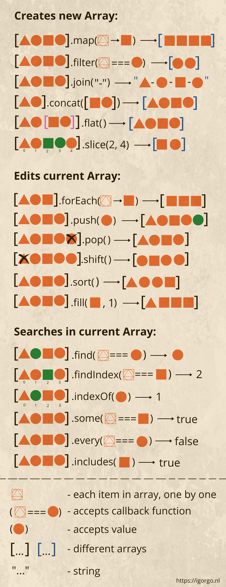

# Array

https://developer.mozilla.org/es/docs/Web/JavaScript/Reference/Global_Objects/Array



### Métodos

- at()
- concat()
- filter()
- find()
- findIndex()
- from() - estático
- includes()
- indexOf()
- isArray() - estático
- join()
- map()
- pop()
- push()
- reverse()
- reduce()
- shift()
- slice()
- sort()
- splice()
- toString()
- unshift()

## at()

Recibe un entero y devuelve el elemento en esa posición. Permite valores negativos. Si no encuentra nada, devuelve `undefined`.

```js
const array1 = [5, 12, 8, 130, 44];

console.log(array1.at(2))    // 8
console.log(array1.at(-2))   // 130
console.log(array1.at(-1))   // 44    // último elemento
console.log(array1.at(12))   // undefined
```

## concat()

Crea un nuevo array que incluye los valores de otros arrays y elementos adicionales.

```js
let arr = [1, 2];

// crea un array a partir de: arr y [3,4]
console.log(arr.concat([3, 4])); // 1,2,3,4

// crea un array a partir de: arr y [3,4] y [5,6]
console.log(arr.concat([3, 4], [5, 6])); // 1,2,3,4,5,6

// crea un array a partir de: arr y [3,4], luego agrega los valores 5 y 6
console.log(arr.concat([3, 4], 5, 6)); // 1,2,3,4,5,6
```

## filter()

Crea un nuevo array con los elementos que cumplan la condición de la función.

```js
let arreglo = [1, 2, 3, 4, 5, 6, 7, 8, 9, 0]
let pares = arreglo.filter(num => num % 2 === 0 && num != 0)
console.log(pares)
```

## find()

Devuelve el valor del primer elemento del array que cumple con la condición, si no devuelve `undefined`.

```js
const array1 = [5, 12, 8, 130, 44];
const found = array1.find(element => element > 10);
console.log(found);
```

## findIndex()

Devuelve el índice del primer elemento que cumpla con la condición. En caso contrario devuelve `-1`.

```js
let arreglo = [1, 2, 3, 4, 5, 6, 7, 8, 9, 0]
console.log(arreglo.findIndex(el => el == 5))
```

## from() - estático

Crea un nuevo array a partir de un objeto iterable...

[javascript.info](https://es.javascript.info/iterable)

## includes()

Determina si un array incluye un elemento, devolviendo `true` o `false`. Puede recibir un 2° parámetro, desde donde empezar a buscar.

```js
const array = [1, 2, 3];
console.log(array.includes(2));    // true
console.log(array.includes(1, 2)); // false
```

## indexOf()

Busca un elemento y devuelve el índice del primer elemento encontrado.

```js
let array = ["3", true, 3, [], {}, "Hi", 3]
console.log(array.indexOf(3))
console.log(array.indexOf(3, 5))
```

## isArray() - estático

Devuelve `true` si es un array, de lo contrario `false`.

```js
console.log(Array.isArray("3"));
console.log(Array.isArray({}));
console.log(Array.isArray([3, 6]));
```

## join()

Une todos los elementos de un array en una cadena y devuelve esta cadena. Se puede pasar como parámetro un separador que es una cadena.

```js
const elements = ['Fire', 'Air', 'Water'];
console.log(elements.join());
console.log(elements.join(''));
console.log(elements.join('-'));
```

## map()

Llama a la función para cada elemento del array y devuelve un nuevo array con los resultados.

```js
let arreglo = [1, 4, 9]
let arregloCuadrado = arreglo.map(numero => numero * numero)
console.log(arregloCuadrado)
```

## pop()

Extrae el último elemento del array y lo devuelve.

```js
let frutas = ["manzana", "banana", "naranja", "pera"]
console.log(frutas.pop())
console.log(frutas)
```

## push()

Agrega uno o más elementos al final de un array y devuelve la nueva longitud del array.

```js
let frutas = ["manzana", "banana", "naranja", "pera"]
console.log(frutas.push("uva", "frutilla"))
console.log(frutas)
```

## reverse()

Invierte el orden de los elementos de un array.

```js
let array = ["3", true, 3, [], {}, "Hi", 88]
console.log(array.reverse())
```

## reduce()

Ejecuta una función reductora sobre cada elemento de un array, devolviendo como resultado un único valor.

```js
let value = arr.reduce(function (accumulator, item, index, array) {
    // ...
}, [initial]);
```

La función es aplicada a todos los elementos del array, uno tras de otro, y va arrastrando el resultado parcial al próximo llamado.

**Argumentos:**

- `accumulator` es el resultado del llamado previo de la función, equivale a initial la primera vez (si initial es dado como argumento).
- `item` es el elemento actual del array.
- `index` es la posición.
- `array` es el array.

Mientras la función sea llamada, el resultado del llamado anterior se pasa al siguiente como primer argumento.

Entonces, el primer argumento es el acumulador que almacena el resultado combinado de todas las veces anteriores en que se ejecutó, y al final se convierte en el resultado de `reduce`.

```js
let arr = [1, 2, 3, 4, 5];
let result = arr.reduce((sum, current) => sum + current, 0);
console.log(result)
```

## shift()

Extrae el primer elemento del array y lo devuelve. Método más lento que `push()` y `pop()`.

```js
let frutas = ["manzana", "banana", "naranja", "pera"]
console.log(frutas.shift())
console.log(frutas)
```

## slice()

Crea un nuevo array y copia elementos desde la posición de inicio hasta el final (no incluido) en el nuevo array. Si se omite el inicio, empieza desde 0. Si se omite el final, se extrae hasta el final.

```js
let array = ["3", true, 3, [], {}, "Hi", 3]
console.log(array.slice(2, 5))
console.log(array.slice(2))
```

## sort()

Ordena los elementos de un arreglo. La ordenación no es necesariamente estable. El modo de ordenación por defecto responde a la posición del valor del string de acuerdo a su valor Unicode.

```js
var arr = [40, 1, 5, 200];
function comparar(a, b) { return a - b; }
arr.sort(comparar);  // [ 1, 5, 40, 200 ]

var arr = [40, 1, 5, 200];
arr.sort(function (a, b) { return a - b; });  // [ 1, 5, 40, 200 ]

var arr = [40, 1, 5, 200];
arr.sort((a, b) => a - b);  // [ 1, 5, 40, 200 ]
console.log(arr)
```

## splice()

Cambia el contenido de un array eliminando elementos existentes y/o agregando nuevos elementos. Devulve un array con los valores eliminados. Si no ha eliminado ningún elemento, devuelve un array vacío. Permite índices negativos.

```js
array.splice(start[, deleteCount[, item1[, item2[, ...]]]])
                |           |               |
         índice donde   n° de elem     items que se
         se comanzara   a eliminar       agregaran
```

```js
// Removiendo elementos
let arr = ["Yo", "estudio", "JavaScript"];
arr.splice(1, 1); // desde el índice 1, remover 1 elemento
console.log(arr); // ["Yo", "JavaScript"]

// Removemos 3 elementos y los reemplazamos con otros 2
let arr1 = ["Yo", "estudio", "JavaScript", "ahora", "mismo"];
arr1.splice(0, 3, "a", "bailar"); // remueve los primeros 3 elementos y los reemplaza con otros
console.log(arr1) // ahora ["a", "bailar", "ahora", "mismo"]

// Devolviendo elementos removidos
let arr2 = ["Yo", "estudio", "JavaScript", "ahora", "mismo"];
let removed = arr2.splice(0, 2); // remueve los 2 primeros elementos
console.log(removed); // "Yo", "estudio" <-- array de los elementos removidos

// Insertar elementos sin remover ningún otro
let arr3 = ["Yo", "estudio", "JavaScript"];
arr.splice(2, 0, "el", "complejo", "language"); // desde el index 2, remover 0 y después insertar "el", "complejo" y "language"
console.log(arr3); // "Yo", "estudio","el", "complejo", "language", "JavaScript"
```

## toString()

Devuelve una cadena de caracteres representando el array.

```js
let arr = [1, 2, 3];
console.log(arr.toString()) // 1,2,3
```

## unshift()

Agrega uno o más elementos al inicio del array, y devuelve la nueva longitud del array. Método más lento que `push()` y code id="mark">pop().

```js
let frutas = ["manzana", "banana", "naranja", "pera"]
console.log(frutas.unshift("uva", "frutilla"))
console.log(frutas)
```